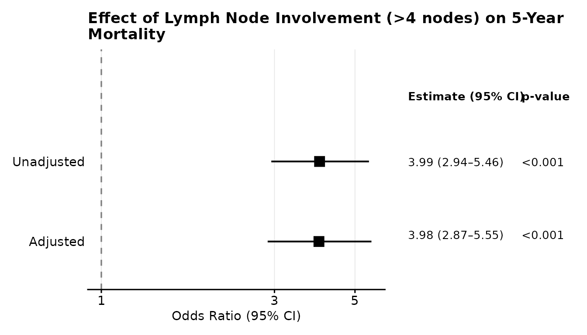
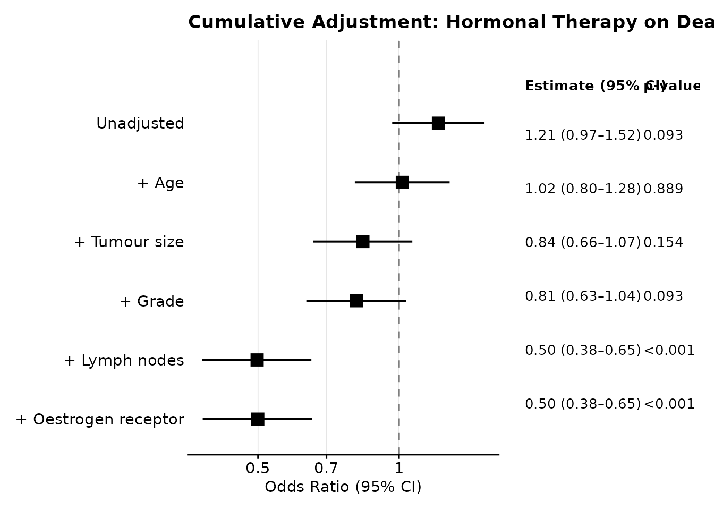
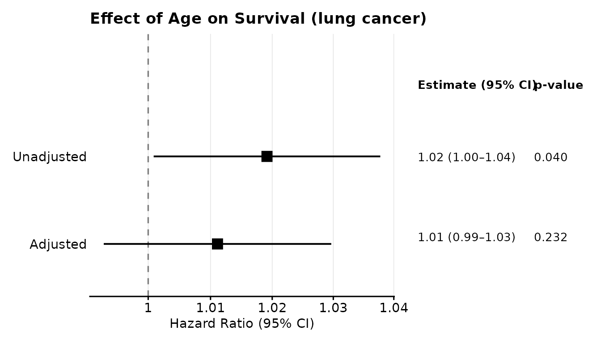
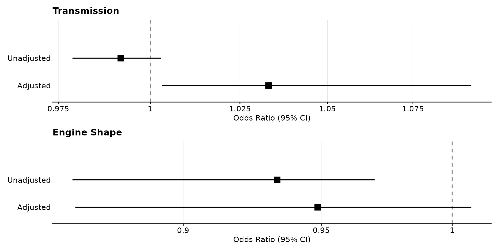
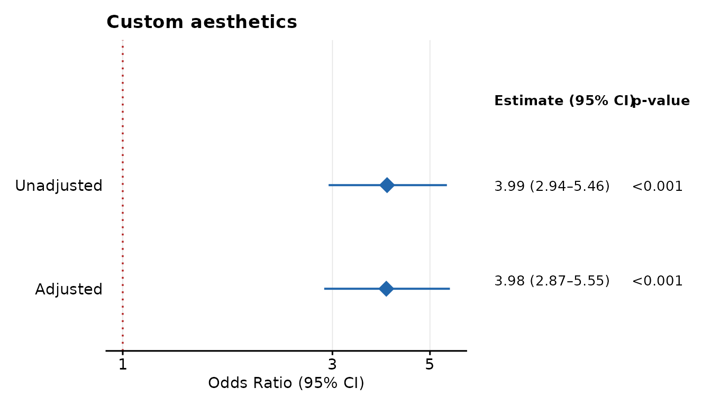

# Introduction to ggadjustedforest

## Installation

``` r

# Install from CRAN
install.packages("ggadjustedforest")

# Or install the development version from GitHub
# install.packages("remotes")
remotes::install_github("kriz98/ggadjustedforest")
```

## Motivation

When building multivariable models for causal inference, there is an
**exposure** of interest for which a causal estimand applies to. The
coefficients for adjusted covariates (confounders) can however be
misinterpreted when presented together with the effect estimate of
interest. Reporting them can even mislead readers, because confounder
coefficients are not identified under the causal model, and are
susceptible to absorbing collider bias, mediation pathways, and other
artefacts depending on causal structures (Hernán & Robins, *Causal
Inference: What If*, 2020; Westreich & Greenland, *Am J Epidemiol*,
2013).

STROBE guidelines (Vandenbroucke et al., 2007) and recent work on the
**estimand framework** (ICH E9(R1), 2019) both emphasise that reporting
should clearly distinguish the target quantity from nuisance parameters.

`ggadjustedforest` operationalises these principles and fits the models
you specify but **only exposes the effect of interest** in both the
forest plots and associated tables, hiding confounder estimates by
design.

An additional feature for exploratory data analysis is also provided
whereby the cumulative addition of covariates can be investigated.

------------------------------------------------------------------------

## Data

All examples use the `rotterdam` breast cancer dataset from the
**survival** package — 2,982 primary breast cancer patients from the
Rotterdam tumour bank. The research question throughout is whether
hormonal therapy (`hormon`) affects survival and recurrence, before and
after adjusting for patient and tumour characteristics.

``` r

library(ggadjustedforest)
#> ggadjustedforest 0.1.1 -- Forest plots for exposure effects, hiding confounders by design.
#> See `?gg_adjusted_forest` to get started.
library(dplyr)
#> 
#> Attaching package: 'dplyr'
#> The following objects are masked from 'package:stats':
#> 
#>     filter, lag
#> The following objects are masked from 'package:base':
#> 
#>     intersect, setdiff, setequal, union
data(cancer, package = "survival")

df <- rotterdam |>
  transmute(
    hormon = hormon,   # 1 = hormonal therapy, 0 = none
    age    = age,
    size   = size,     # tumour size (mm)
    grade  = grade,    # tumour grade
    nodes  = nodes,    # positive lymph nodes
    er10   = er / 10,  # oestrogen receptor (fmol/10 l)
    recur  = recur,    # recurrence (0/1)
    death  = death,    # all-cause death (0/1)
    rtime  = rtime,    # time to recurrence/censoring
    dtime  = dtime     # time to death/censoring
  ) |>
  tidyr::drop_na()

covariates <- c("age", "size", "grade", "nodes", "er10")
```

------------------------------------------------------------------------

## Basic usage — logistic regression

The pipe-friendly API puts `data` first so the function composes
naturally with `|>`:

``` r

result <- df |>
  gg_adjusted_forest(
    outcome    = "death",
    exposure   = "hormon",
    covariates = covariates,
    model_type = "logistic",
    title      = "Effect of Hormonal Therapy on Death (Logistic)"
  )
result$table
#> # A tibble: 2 × 6
#>   model      estimate conf.low conf.high     p.value     n
#>   <fct>         <dbl>    <dbl>     <dbl>       <dbl> <int>
#> 1 Unadjusted    1.21     0.967     1.52  0.0935       2982
#> 2 Adjusted      0.499    0.381     0.652 0.000000411  2982
```

The returned object has three components:

| Component          | Contents                                           |
|--------------------|----------------------------------------------------|
| `$plot`            | Combined forest plot + table (ggplot2 / patchwork) |
| `$table`           | Tibble of numeric estimates                        |
| `$formatted_table` | Tibble with formatted “OR (lower–upper)” strings   |

To render the plot:

``` r

result$plot
```



------------------------------------------------------------------------

## Cumulative adjustment

Although generally recommended against when performing causal inference,
sequential addition of covariates may be helpful when building
regression models for predictive and descriptive aims. As such, this
feature is provided to visualise how the effect estimate changes as
covariates are added sequentially. This may aid in the selection of a
parsimonious model with the best fit as recommended by the principles
laid out in *R for Health Data Science* by Ewen Harrison and Riinu Pius.

### Collapsibility and interpreting sequential estimates

A key consideration when using cumulative adjustment is whether the
effect measure being modelled is **collapsible**. A collapsible effect
measure is one where the marginal (unadjusted) estimate equals a
weighted average of the stratum-specific (adjusted) estimates. For
collapsible measures, a change in the exposure coefficient as covariates
are added can be interpreted as evidence of confounding. For
non-collapsible measures, the coefficient changes simply because adding
covariates alters the residual variance on the underlying latent scale —
even when there is no confounding at all.

| Model type   | Effect measure  | Collapsible | Cumulative display interpretable? |
|--------------|-----------------|:-----------:|:---------------------------------:|
| `"linear"`   | Risk difference |   ✅ Yes    |              ✅ Yes               |
| `"poisson"`  | Risk ratio      |   ✅ Yes    |              ✅ Yes               |
| `"logistic"` | Odds ratio      |    ❌ No    |        ⚠️ Use with caution        |
| `"coxph"`    | Hazard ratio    |    ❌ No    |        ⚠️ Use with caution        |

When `cumulative = TRUE` is used with `"logistic"` or `"coxph"`,
`ggadjustedforest` will emit a warning to this effect. The feature is
retained because it remains useful in descriptive and predictive
modelling contexts — for example, when assessing whether model fit
improves with each additional covariate — but the sequential change in
OR or HR should not be interpreted as a direct measure of confounding.

For a full treatment of non-collapsibility see Greenland (1987) and
Hernán (2010).

To use this feature, set `cumulative = TRUE` and use `cumulative_labels`
to provide human-readable row names:

``` r

result_cum <- gg_adjusted_forest(
  data       = df,
  outcome    = "death",
  exposure   = "hormon",
  covariates = covariates,
  model_type = "logistic",
  cumulative = TRUE,
  cumulative_labels = c(
    "Unadjusted"                       = "Unadjusted",
    "+ age"                            = "+ Age",
    "+ age + size"                     = "+ Tumour size",
    "+ age + size + grade"             = "+ Grade",
    "+ age + size + grade + nodes"     = "+ Lymph nodes",
    "+ age + size + grade + nodes + er10" = "+ Oestrogen receptor"
  ),
  title = "Cumulative Adjustment: Hormonal Therapy on Death"
)
result_cum$plot
```



The numeric table is available for downstream use:

``` r

result_cum$formatted_table[, c("model", "formatted", "p.value")]
#> # A tibble: 6 × 3
#>   model                formatted        p.value
#>   <chr>                <chr>            <chr>  
#> 1 Unadjusted           1.21 (0.97–1.52) 0.093  
#> 2 + Age                1.02 (0.80–1.28) 0.889  
#> 3 + Tumour size        0.84 (0.66–1.07) 0.154  
#> 4 + Grade              0.81 (0.63–1.04) 0.093  
#> 5 + Lymph nodes        0.50 (0.38–0.65) <0.001 
#> 6 + Oestrogen receptor 0.50 (0.38–0.65) <0.001
```

------------------------------------------------------------------------

## Cox proportional hazards regression

For time-to-event outcomes supply `model_type = "coxph"` along with
`time_var` and `event_var`:

``` r

result_cox <- gg_adjusted_forest(
  data       = df,
  outcome    = "death",
  exposure   = "hormon",
  covariates = covariates,
  model_type = "coxph",
  time_var   = "dtime",
  event_var  = "death",
  title      = "Effect of Hormonal Therapy on Survival (Rotterdam)"
)
result_cox$plot
```



------------------------------------------------------------------------

## Comparing multiple outcomes side-by-side

`ggadjustedforest` intentionally does not provide a built-in
multi-outcome wrapper. Each outcome deserves its own carefully specified
model, and bundling them into a single function call obscures that.
Instead, fit each outcome separately and stack the plots with
`patchwork`, which is already a dependency of `ggadjustedforest`:

``` r

library(patchwork)

p_death <- gg_adjusted_forest(
  data = df, outcome = "death", exposure = "hormon",
  covariates = covariates, model_type = "coxph",
  time_var = "dtime", event_var = "death",
  title = "Overall survival", show_table = FALSE
)$plot

p_recur <- gg_adjusted_forest(
  data = df, outcome = "recur", exposure = "hormon",
  covariates = covariates, model_type = "coxph",
  time_var = "rtime", event_var = "recur",
  title = "Recurrence-free survival", show_table = FALSE
)$plot

p_death / p_recur
```



This approach gives full control over each panel — different covariate
sets, model types, or axis scales per outcome. The `/` operator stacks
plots vertically; use `|` for side-by-side.

------------------------------------------------------------------------

## Customising appearance

All the major aesthetic parameters are exposed:

``` r

gg_adjusted_forest(
  data           = df,
  outcome        = "death",
  exposure       = "hormon",
  covariates     = covariates,
  model_type     = "coxph",
  time_var       = "dtime",
  event_var      = "death",
  color          = "#2166ac",
  point_size     = 5,
  point_shape    = 18,
  vline_color    = "firebrick",
  vline_linetype = "dotted",
  title          = "Custom aesthetics"
)$plot
```



------------------------------------------------------------------------

## Extracting the table only

Use
[`forest_table()`](https://kriz98.github.io/gg_adjusted_forest/reference/forest_table.md)
when you only need the numbers:

``` r

forest_table(
  data       = df,
  outcome    = "death",
  exposure   = "hormon",
  covariates = covariates,
  model_type = "logistic"
)
#> # A tibble: 2 × 6
#>   model      estimate ci        formatted        p.value     n
#>   <chr>      <chr>    <chr>     <chr>            <chr>   <int>
#> 1 Unadjusted 1.21     0.97–1.52 1.21 (0.97–1.52) 0.093    2982
#> 2 Adjusted   0.50     0.38–0.65 0.50 (0.38–0.65) <0.001   2982
```

------------------------------------------------------------------------

## References

- Greenland S (1987). Interpretation and choice of effect measures in
  epidemiologic analyses. *Am J Epidemiol* 125(5): 761–768.
- Harrison E, Pius R (2021). *R for Health Data Science*. CRC Press.
- Hernán MA (2010). The hazards of hazard ratios. *Epidemiology* 21(1):
  13–15.
- Hernán MA, Robins JM (2020). *Causal Inference: What If*. Chapman &
  Hall/CRC.
- Royston P, Altman DG (2013). External validation of a Cox prognostic
  model: principles and methods. *BMC Med Res Methodol* 13:33.
  (Rotterdam dataset)
- Vandenbroucke JP et al. (2007). Strengthening the Reporting of
  Observational Studies in Epidemiology (STROBE). *PLoS Med* 4(10):
  e297.
- Westreich D, Greenland S (2013). The table 2 fallacy: presenting and
  interpreting confounder and modifier coefficients. *Am J Epidemiol*
  177(4): 292–298.
- ICH E9(R1) (2019). Statistical Principles for Clinical Trials:
  Addendum on Estimands and Sensitivity Analysis in Clinical Trials. ICH
  Harmonised Guideline.
