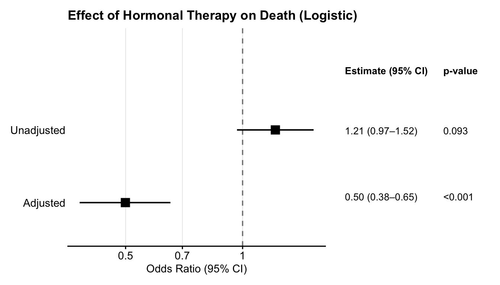
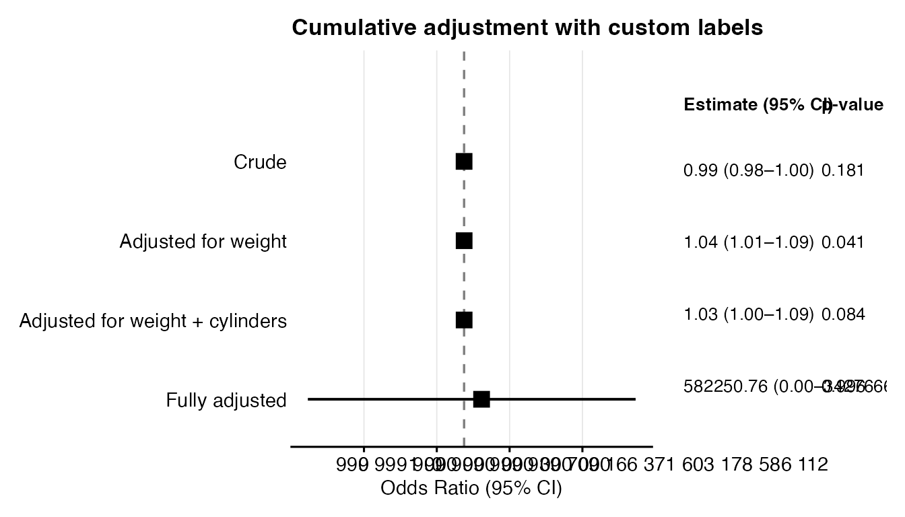
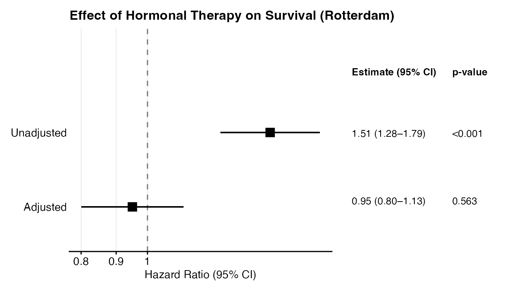
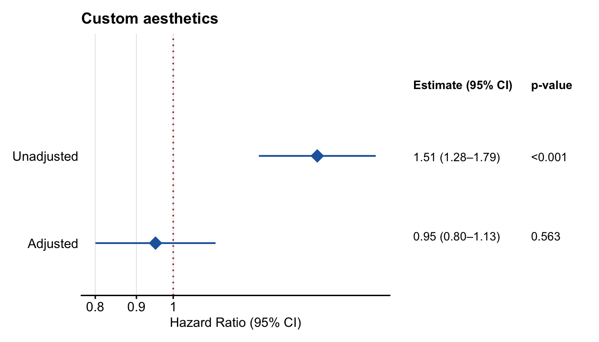
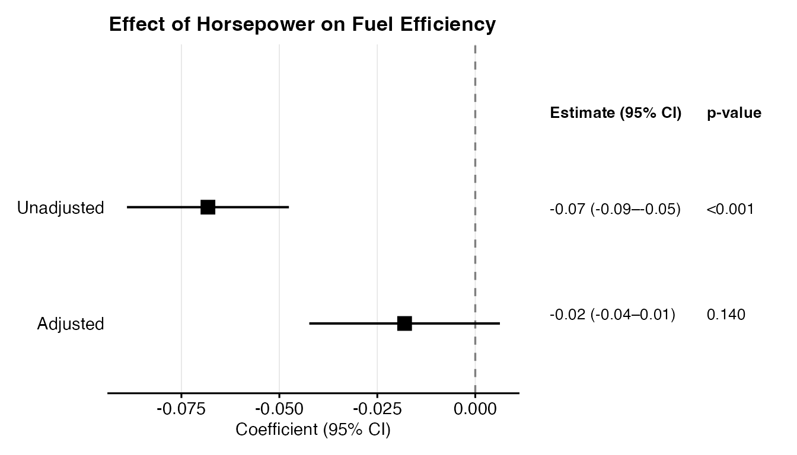
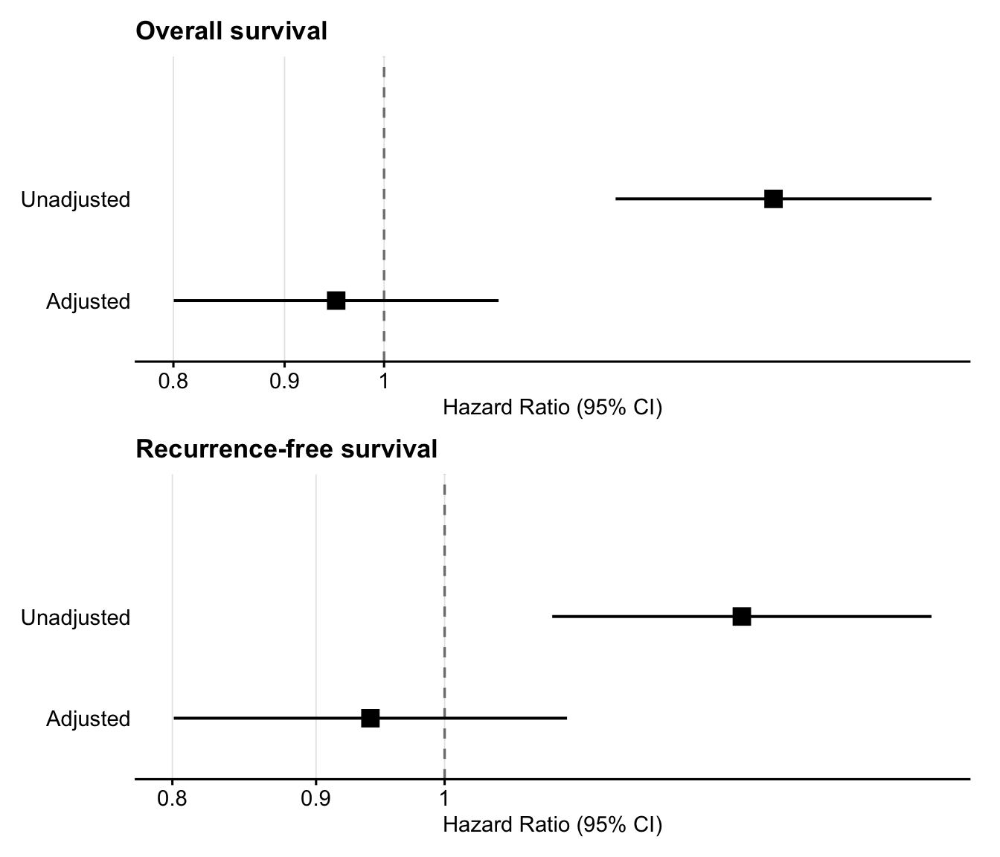

# Introduction to ggadjustedforest

## Installation

``` r

# Install from GitHub (CRAN submission pending)
# install.packages("remotes")
remotes::install_github("kriz98/gg_adjusted_forest")
```

## Motivation

When building multivariable models for causal inference, there is an
**exposure** of interest for which a causal estimand applies to. The
coefficients for adjusted covariates (confounders) can however be
misinterpreted when presented together with the estimand of interest.
Reporting them can even mislead readers, because confounder coefficients
are not identified under the causal model, and are susceptible to
absorbing collider bias, mediation pathways, and other artefacts
depending on causal structures (Hernán & Robins, *Causal Inference: What
If*, 2020; Westreich & Greenland, *Am J Epidemiol*, 2013).

STROBE guidelines (Vandenbroucke et al., 2007) and recent work on the
**estimand framework** (ICH E9(R1), 2019) both emphasise that reporting
should clearly distinguish the target quantity from nuisance parameters.

`ggadjustedforest` operationalises this principle and fits the models
you specify but **only exposes the coefficient of interest** in both the
plot and the table, hiding confounder estimates by design. We also
provide a cumulative adjustment option, to show the effect of adjustment
and model building during exploratory phases of studies.

------------------------------------------------------------------------

## Basic usage — logistic regression

``` r

library(ggadjustedforest)
#> ggadjustedforest 0.1.0 -- Forest plots for exposure effects, hiding confounders by design.
#> See `?gg_adjusted_forest` to get started.

data(mtcars)
mtcars$am <- as.integer(mtcars$am)   # binary outcome: automatic (0) vs manual (1)

result <- gg_adjusted_forest(
  data       = mtcars,
  outcome    = "am",
  exposure   = "hp",
  covariates = c("wt", "cyl"),
  model_type = "logistic",
  title      = "Effect of Horsepower on Transmission Type"
)
#> Warning: glm.fit: fitted probabilities numerically 0 or 1 occurred
#> Warning: glm.fit: fitted probabilities numerically 0 or 1 occurred
#> Warning: glm.fit: fitted probabilities numerically 0 or 1 occurred
#> Warning: glm.fit: fitted probabilities numerically 0 or 1 occurred
#> Warning: glm.fit: fitted probabilities numerically 0 or 1 occurred
#> Warning: glm.fit: fitted probabilities numerically 0 or 1 occurred
#> Warning: glm.fit: fitted probabilities numerically 0 or 1 occurred
#> Warning: glm.fit: fitted probabilities numerically 0 or 1 occurred
#> Warning: glm.fit: fitted probabilities numerically 0 or 1 occurred
#> Warning: glm.fit: fitted probabilities numerically 0 or 1 occurred
#> Warning: glm.fit: fitted probabilities numerically 0 or 1 occurred
#> Warning: glm.fit: fitted probabilities numerically 0 or 1 occurred
#> Warning: glm.fit: fitted probabilities numerically 0 or 1 occurred
#> Warning: glm.fit: fitted probabilities numerically 0 or 1 occurred
#> Warning: glm.fit: fitted probabilities numerically 0 or 1 occurred
#> Warning: glm.fit: fitted probabilities numerically 0 or 1 occurred
#> Warning: glm.fit: fitted probabilities numerically 0 or 1 occurred
#> Warning: glm.fit: fitted probabilities numerically 0 or 1 occurred
#> Warning: glm.fit: fitted probabilities numerically 0 or 1 occurred
#> Warning: glm.fit: fitted probabilities numerically 0 or 1 occurred
#> Warning: glm.fit: fitted probabilities numerically 0 or 1 occurred
#> Warning: glm.fit: fitted probabilities numerically 0 or 1 occurred
result$table
#> # A tibble: 2 × 6
#>   model      estimate conf.low conf.high p.value     n
#>   <fct>         <dbl>    <dbl>     <dbl>   <dbl> <int>
#> 1 Unadjusted    0.992    0.979      1.00  0.181     32
#> 2 Adjusted      1.03     1.00       1.09  0.0840    32
```

The returned object has three components:

| Component          | Contents                                           |
|--------------------|----------------------------------------------------|
| `$plot`            | Combined forest plot + table (ggplot2 / patchwork) |
| `$table`           | Numeric data frame                                 |
| `$formatted_table` | Character table with formatted CI strings          |

To render the plot:

``` r

result$plot
```



------------------------------------------------------------------------

## Cumulative adjustment

When you want to visualise how the effect estimate changes as
confounders are added sequentially — a common presentation in
epidemiological reporting — use `cumulative = TRUE`:

``` r

result_cum <- gg_adjusted_forest(
  data       = mtcars,
  outcome    = "am",
  exposure   = "hp",
  covariates = c("wt", "cyl", "disp"),
  cumulative = TRUE,
  title      = "Cumulative adjustment: hp on transmission"
)
#> Warning: glm.fit: fitted probabilities numerically 0 or 1 occurred
#> Warning: glm.fit: fitted probabilities numerically 0 or 1 occurred
#> Warning: glm.fit: fitted probabilities numerically 0 or 1 occurred
#> Warning: glm.fit: fitted probabilities numerically 0 or 1 occurred
#> Warning: glm.fit: fitted probabilities numerically 0 or 1 occurred
#> Warning: glm.fit: fitted probabilities numerically 0 or 1 occurred
#> Warning: glm.fit: fitted probabilities numerically 0 or 1 occurred
#> Warning: glm.fit: fitted probabilities numerically 0 or 1 occurred
#> Warning: glm.fit: fitted probabilities numerically 0 or 1 occurred
#> Warning: glm.fit: fitted probabilities numerically 0 or 1 occurred
#> Warning: glm.fit: fitted probabilities numerically 0 or 1 occurred
#> Warning: glm.fit: fitted probabilities numerically 0 or 1 occurred
#> Warning: glm.fit: fitted probabilities numerically 0 or 1 occurred
#> Warning: glm.fit: fitted probabilities numerically 0 or 1 occurred
#> Warning: glm.fit: fitted probabilities numerically 0 or 1 occurred
#> Warning: glm.fit: fitted probabilities numerically 0 or 1 occurred
#> Warning: glm.fit: fitted probabilities numerically 0 or 1 occurred
#> Warning: glm.fit: fitted probabilities numerically 0 or 1 occurred
#> Warning: glm.fit: fitted probabilities numerically 0 or 1 occurred
#> Warning: glm.fit: fitted probabilities numerically 0 or 1 occurred
#> Warning: glm.fit: fitted probabilities numerically 0 or 1 occurred
#> Warning: glm.fit: fitted probabilities numerically 0 or 1 occurred
#> Warning: glm.fit: fitted probabilities numerically 0 or 1 occurred
#> Warning: glm.fit: fitted probabilities numerically 0 or 1 occurred
#> Warning: glm.fit: fitted probabilities numerically 0 or 1 occurred
#> Warning: glm.fit: fitted probabilities numerically 0 or 1 occurred
#> Warning: glm.fit: fitted probabilities numerically 0 or 1 occurred
#> Warning: glm.fit: fitted probabilities numerically 0 or 1 occurred
#> Warning: glm.fit: fitted probabilities numerically 0 or 1 occurred
#> Warning: glm.fit: fitted probabilities numerically 0 or 1 occurred
#> Warning: glm.fit: fitted probabilities numerically 0 or 1 occurred
#> Warning: glm.fit: fitted probabilities numerically 0 or 1 occurred
#> Warning: glm.fit: fitted probabilities numerically 0 or 1 occurred
#> Warning: glm.fit: fitted probabilities numerically 0 or 1 occurred
#> Warning: glm.fit: fitted probabilities numerically 0 or 1 occurred
#> Warning: glm.fit: fitted probabilities numerically 0 or 1 occurred
#> Warning: glm.fit: fitted probabilities numerically 0 or 1 occurred
#> Warning: glm.fit: fitted probabilities numerically 0 or 1 occurred
#> Warning: glm.fit: algorithm did not converge
#> Warning: glm.fit: fitted probabilities numerically 0 or 1 occurred
#> Warning: glm.fit: fitted probabilities numerically 0 or 1 occurred
#> Warning: glm.fit: fitted probabilities numerically 0 or 1 occurred
#> Warning: glm.fit: fitted probabilities numerically 0 or 1 occurred
#> Warning: glm.fit: fitted probabilities numerically 0 or 1 occurred
#> Warning: glm.fit: fitted probabilities numerically 0 or 1 occurred
#> Warning: glm.fit: fitted probabilities numerically 0 or 1 occurred
#> Warning: glm.fit: fitted probabilities numerically 0 or 1 occurred
#> Warning: glm.fit: fitted probabilities numerically 0 or 1 occurred
#> Warning: glm.fit: fitted probabilities numerically 0 or 1 occurred
#> Warning: glm.fit: fitted probabilities numerically 0 or 1 occurred
result_cum$formatted_table[, c("model", "formatted", "p.value")]
#> # A tibble: 4 × 3
#>   model             formatted                                            p.value
#>   <chr>             <chr>                                                <chr>  
#> 1 Unadjusted        0.99 (0.98–1.00)                                     0.181  
#> 2 + wt              1.04 (1.01–1.09)                                     0.041  
#> 3 + wt + cyl        1.03 (1.00–1.09)                                     0.084  
#> 4 + wt + cyl + disp 582250.76 (0.00–34276667019411821430816467159897275… 0.996
```

You can rename the rows with `cumulative_labels`:

``` r

labels <- c(
  "Unadjusted"         = "Crude",
  "+ wt"               = "Adjusted for weight",
  "+ wt + cyl"         = "Adjusted for weight + cylinders",
  "+ wt + cyl + disp"  = "Fully adjusted"
)

result_cum2 <- gg_adjusted_forest(
  data              = mtcars,
  outcome           = "am",
  exposure          = "hp",
  covariates        = c("wt", "cyl", "disp"),
  cumulative        = TRUE,
  cumulative_labels = labels,
  title             = "Cumulative adjustment with custom labels"
)
#> Warning: glm.fit: fitted probabilities numerically 0 or 1 occurred
#> Warning: glm.fit: fitted probabilities numerically 0 or 1 occurred
#> Warning: glm.fit: fitted probabilities numerically 0 or 1 occurred
#> Warning: glm.fit: fitted probabilities numerically 0 or 1 occurred
#> Warning: glm.fit: fitted probabilities numerically 0 or 1 occurred
#> Warning: glm.fit: fitted probabilities numerically 0 or 1 occurred
#> Warning: glm.fit: fitted probabilities numerically 0 or 1 occurred
#> Warning: glm.fit: fitted probabilities numerically 0 or 1 occurred
#> Warning: glm.fit: fitted probabilities numerically 0 or 1 occurred
#> Warning: glm.fit: fitted probabilities numerically 0 or 1 occurred
#> Warning: glm.fit: fitted probabilities numerically 0 or 1 occurred
#> Warning: glm.fit: fitted probabilities numerically 0 or 1 occurred
#> Warning: glm.fit: fitted probabilities numerically 0 or 1 occurred
#> Warning: glm.fit: fitted probabilities numerically 0 or 1 occurred
#> Warning: glm.fit: fitted probabilities numerically 0 or 1 occurred
#> Warning: glm.fit: fitted probabilities numerically 0 or 1 occurred
#> Warning: glm.fit: fitted probabilities numerically 0 or 1 occurred
#> Warning: glm.fit: fitted probabilities numerically 0 or 1 occurred
#> Warning: glm.fit: fitted probabilities numerically 0 or 1 occurred
#> Warning: glm.fit: fitted probabilities numerically 0 or 1 occurred
#> Warning: glm.fit: fitted probabilities numerically 0 or 1 occurred
#> Warning: glm.fit: fitted probabilities numerically 0 or 1 occurred
#> Warning: glm.fit: fitted probabilities numerically 0 or 1 occurred
#> Warning: glm.fit: fitted probabilities numerically 0 or 1 occurred
#> Warning: glm.fit: fitted probabilities numerically 0 or 1 occurred
#> Warning: glm.fit: fitted probabilities numerically 0 or 1 occurred
#> Warning: glm.fit: fitted probabilities numerically 0 or 1 occurred
#> Warning: glm.fit: fitted probabilities numerically 0 or 1 occurred
#> Warning: glm.fit: fitted probabilities numerically 0 or 1 occurred
#> Warning: glm.fit: fitted probabilities numerically 0 or 1 occurred
#> Warning: glm.fit: fitted probabilities numerically 0 or 1 occurred
#> Warning: glm.fit: fitted probabilities numerically 0 or 1 occurred
#> Warning: glm.fit: fitted probabilities numerically 0 or 1 occurred
#> Warning: glm.fit: fitted probabilities numerically 0 or 1 occurred
#> Warning: glm.fit: fitted probabilities numerically 0 or 1 occurred
#> Warning: glm.fit: fitted probabilities numerically 0 or 1 occurred
#> Warning: glm.fit: fitted probabilities numerically 0 or 1 occurred
#> Warning: glm.fit: fitted probabilities numerically 0 or 1 occurred
#> Warning: glm.fit: algorithm did not converge
#> Warning: glm.fit: fitted probabilities numerically 0 or 1 occurred
#> Warning: glm.fit: fitted probabilities numerically 0 or 1 occurred
#> Warning: glm.fit: fitted probabilities numerically 0 or 1 occurred
#> Warning: glm.fit: fitted probabilities numerically 0 or 1 occurred
#> Warning: glm.fit: fitted probabilities numerically 0 or 1 occurred
#> Warning: glm.fit: fitted probabilities numerically 0 or 1 occurred
#> Warning: glm.fit: fitted probabilities numerically 0 or 1 occurred
#> Warning: glm.fit: fitted probabilities numerically 0 or 1 occurred
#> Warning: glm.fit: fitted probabilities numerically 0 or 1 occurred
#> Warning: glm.fit: fitted probabilities numerically 0 or 1 occurred
#> Warning: glm.fit: fitted probabilities numerically 0 or 1 occurred
result_cum2$plot
```



------------------------------------------------------------------------

## Cox proportional hazards regression

For time-to-event outcomes supply `model_type = "coxph"` along with
`time_var` and `event_var`:

``` r

lung <- survival::lung
lung$status01 <- as.integer(lung$status == 2)
lung <- stats::na.omit(lung[, c("time", "status01", "age", "sex", "ph.ecog")])

result_cox <- gg_adjusted_forest(
  data       = lung,
  outcome    = "status01",
  exposure   = "age",
  covariates = c("sex", "ph.ecog"),
  model_type = "coxph",
  time_var   = "time",
  event_var  = "status01",
  title      = "Effect of Age on Survival (lung cancer)"
)
result_cox$plot
```



------------------------------------------------------------------------

## Customising appearance

All the major aesthetic parameters are exposed:

``` r

gg_adjusted_forest(
  data           = mtcars,
  outcome        = "am",
  exposure       = "hp",
  covariates     = "wt",
  model_type     = "logistic",
  color          = "#2166ac",
  point_size     = 5,
  point_shape    = 18,          # diamond
  vline_color    = "firebrick",
  vline_linetype = "dotted",
  x_breaks       = c(0.9, 1.0, 1.1),
  title          = "Custom aesthetics"
)$plot
#> Warning: glm.fit: fitted probabilities numerically 0 or 1 occurred
#> Warning: glm.fit: fitted probabilities numerically 0 or 1 occurred
#> Warning: glm.fit: fitted probabilities numerically 0 or 1 occurred
#> Warning: glm.fit: fitted probabilities numerically 0 or 1 occurred
#> Warning: glm.fit: fitted probabilities numerically 0 or 1 occurred
#> Warning: glm.fit: fitted probabilities numerically 0 or 1 occurred
#> Warning: glm.fit: fitted probabilities numerically 0 or 1 occurred
#> Warning: glm.fit: fitted probabilities numerically 0 or 1 occurred
#> Warning: glm.fit: fitted probabilities numerically 0 or 1 occurred
#> Warning: glm.fit: fitted probabilities numerically 0 or 1 occurred
#> Warning: glm.fit: fitted probabilities numerically 0 or 1 occurred
#> Warning: glm.fit: fitted probabilities numerically 0 or 1 occurred
#> Warning: glm.fit: fitted probabilities numerically 0 or 1 occurred
#> Warning: glm.fit: fitted probabilities numerically 0 or 1 occurred
#> Warning: glm.fit: fitted probabilities numerically 0 or 1 occurred
#> Warning: glm.fit: fitted probabilities numerically 0 or 1 occurred
```



For linear models the x-axis is on the original scale (not log):

``` r

gg_adjusted_forest(
  data       = mtcars,
  outcome    = "mpg",
  exposure   = "hp",
  covariates = c("wt", "cyl"),
  model_type = "linear",
  title      = "Effect of Horsepower on Fuel Efficiency"
)$plot
```



------------------------------------------------------------------------

## Extracting the table only

Use
[`forest_table()`](https://kriz98.github.io/gg_adjusted_forest/reference/forest_table.md)
when you only need the numbers:

``` r

forest_table(
  data       = mtcars,
  outcome    = "am",
  exposure   = "hp",
  covariates = c("wt", "cyl"),
  model_type = "logistic"
)
#> Warning: glm.fit: fitted probabilities numerically 0 or 1 occurred
#> Warning: glm.fit: fitted probabilities numerically 0 or 1 occurred
#> Warning: glm.fit: fitted probabilities numerically 0 or 1 occurred
#> Warning: glm.fit: fitted probabilities numerically 0 or 1 occurred
#> Warning: glm.fit: fitted probabilities numerically 0 or 1 occurred
#> Warning: glm.fit: fitted probabilities numerically 0 or 1 occurred
#> Warning: glm.fit: fitted probabilities numerically 0 or 1 occurred
#> Warning: glm.fit: fitted probabilities numerically 0 or 1 occurred
#> Warning: glm.fit: fitted probabilities numerically 0 or 1 occurred
#> Warning: glm.fit: fitted probabilities numerically 0 or 1 occurred
#> Warning: glm.fit: fitted probabilities numerically 0 or 1 occurred
#> Warning: glm.fit: fitted probabilities numerically 0 or 1 occurred
#> Warning: glm.fit: fitted probabilities numerically 0 or 1 occurred
#> Warning: glm.fit: fitted probabilities numerically 0 or 1 occurred
#> Warning: glm.fit: fitted probabilities numerically 0 or 1 occurred
#> Warning: glm.fit: fitted probabilities numerically 0 or 1 occurred
#> Warning: glm.fit: fitted probabilities numerically 0 or 1 occurred
#> Warning: glm.fit: fitted probabilities numerically 0 or 1 occurred
#> Warning: glm.fit: fitted probabilities numerically 0 or 1 occurred
#> Warning: glm.fit: fitted probabilities numerically 0 or 1 occurred
#> Warning: glm.fit: fitted probabilities numerically 0 or 1 occurred
#> Warning: glm.fit: fitted probabilities numerically 0 or 1 occurred
#> # A tibble: 2 × 6
#>   model      estimate ci        formatted        p.value     n
#>   <chr>      <chr>    <chr>     <chr>            <chr>   <int>
#> 1 Unadjusted 0.99     0.98–1.00 0.99 (0.98–1.00) 0.181      32
#> 2 Adjusted   1.03     1.00–1.09 1.03 (1.00–1.09) 0.084      32
```

------------------------------------------------------------------------

## Comparing multiple outcomes side-by-side

`ggadjustedforest` intentionally does not provide a built-in
multi-outcome wrapper. Each outcome deserves its own carefully specified
model, and bundling them into a single function call obscures that.
Instead, fit each outcome separately and stack the plots with
`patchwork`, which is already a dependency of `ggadjustedforest`:

``` r

library(patchwork)

data(mtcars)
mtcars$am <- as.integer(mtcars$am)
mtcars$vs <- as.integer(mtcars$vs)

# Extract $plot — patchwork composes ggplot2 objects directly
p_am <- gg_adjusted_forest(
  data = mtcars, outcome = "am", exposure = "hp",
  covariates = c("wt", "cyl"), model_type = "logistic",
  title = "Transmission", show_table = FALSE
)$plot

p_vs <- gg_adjusted_forest(
  data = mtcars, outcome = "vs", exposure = "hp",
  covariates = c("wt", "cyl"), model_type = "logistic",
  title = "Engine Shape", show_table = FALSE
)$plot

p_am / p_vs
```



This approach gives full control over each panel — different covariate
sets, model types, or axis scales per outcome. The `/` operator stacks
plots vertically; use `|` for side-by-side. Pass
`plot_layout(guides = "collect")` to share a legend if needed.

------------------------------------------------------------------------

## References

- Hernán MA, Robins JM (2020). *Causal Inference: What If*. Chapman &
  Hall/CRC.
- Vandenbroucke JP et al. (2007). Strengthening the Reporting of
  Observational Studies in Epidemiology (STROBE). *PLoS Med* 4(10):
  e297.
- Westreich D, Greenland S (2013). The table 2 fallacy: presenting and
  interpreting confounder and modifier coefficients. *Am J Epidemiol*
  177(4): 292–298.
- ICH E9(R1) (2019). Statistical Principles for Clinical Trials:
  Addendum on Estimands and Sensitivity Analysis in Clinical Trials. ICH
  Harmonised Guideline.
